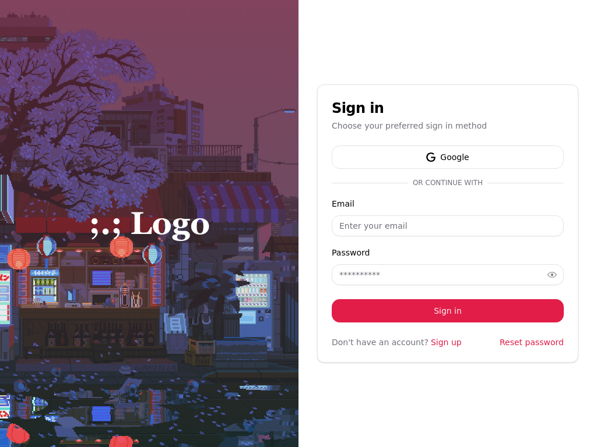
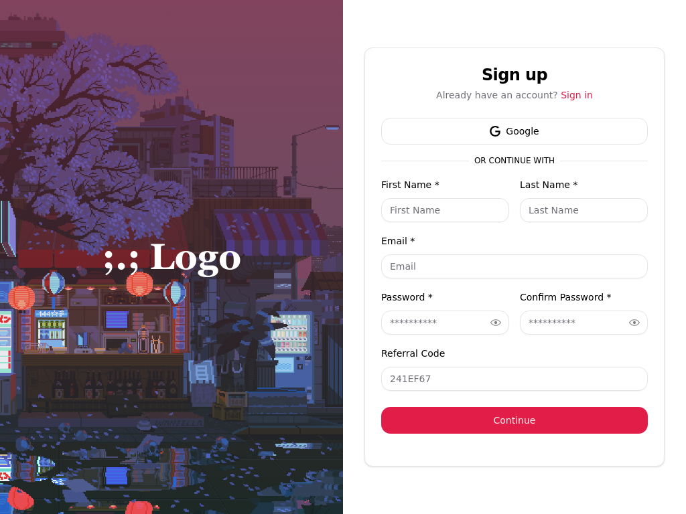

# Best NextJS Authentication System 🌟

A state-of-the-art authentication solution for any NextJS platforms, offering a blend of security, usability, and scalability.


## Table of Contents

- [Features](#features)
- [Screenshots](#screenshots)
- [Installation](#installation)
- [Environment Variables](#environment-variables)
- [Usage](#usage)
- [Deployment](#deployment)
- [Contributing](#contributing)
- [License](#license)
- [Acknowledgments](#acknowledgments)
- [Contact](#contact)

## Features

- Secure authentication with Clerk
- Single Sign-On (SSO) support
- Email verification flow
- Password reset functionality
- Responsive design for mobile and desktop

## Screenshots


<div align="center">

<h3 align="center">SignIn Screen</h3>

<a href="https://itspinion-auth.vercel.app/" >

</a>

<h3 align="center">SignUp Screen</h3>

<a href="https://itspinion-auth.vercel.app/" >

</a>

</div>

## Installation

### Prerequisites

Ensure you have Node.js installed on your machine.

```bash
node --version
npm --version
```

### Steps

1. Clone the repository:

   ```bash
   git clone https://github.com/ItsPinion/NextJS-Auth-Template.git
   ```

2. Navigate into the directory:

   ```bash
   cd NextJS-Auth-Template
   ```

3. Install dependencies:

   ```bash
   npm install
   # or
   bun install
   ```

4. Copy `.env.example` to `.env` and fill in the required values.

5. Start the development server:

   ```bash
   npm run dev
   # or
   bun dev
   ```

   or

6. Build and start the server:

   ```bash
   npm run build
   npm start
   # or
   bun run build
   bun start
   ```

  
   

## Environment Variables

- `DATABASE_URL`: Connection string for your database.
- `CLERK_SECRET_KEY`: Clerk secret key for authentication.
- `NEXT_PUBLIC_CLERK_PUBLISHABLE_KEY`: Clerk publishable key exposed to the client side.

## Usage

Navigate to `http://localhost:3000` in your web browser and click the sign in button to start the authentication process.

## Deployment

Deployed using Vercel. Continuous deployment is configured via GitHub Actions.

## Contributing

We welcome contributions! Please read our [Contributing Guide](CONTRIBUTING.md) for details on how to submit pull requests to us.

## License

MIT [License](LICENSE.md) © ItsPinion

## Acknowledgments


- The [Shadcn UI](https://ui.shadcn.com/) library for providing a modern and clean UI.
- [Clerk](https://clerk.com/) for handling authentication and user sessions.
- [Drizzle ORM](https://orm.drizzle.team/) for efficient data management.
- The open-source community for their contributions and support.

## Contact

For any questions or feedback, please contact the project maintainer(ME) at our discord server [Pinion's Nest](https://discord.gg/XnzQUw3FPR).
